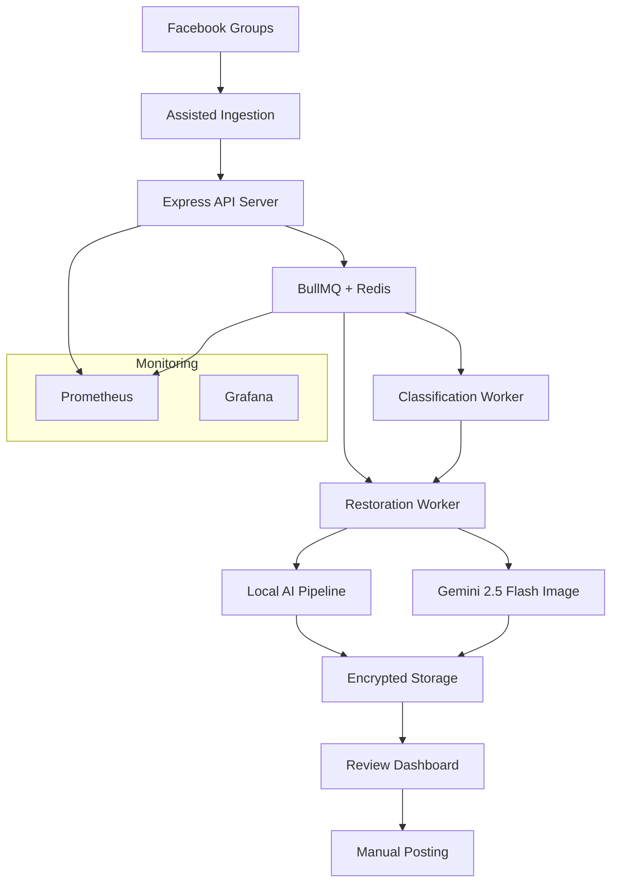

# Design Document

## Overview

The AI Photo Restoration Service is a local-first, human-in-the-loop system that processes Facebook photo restoration requests using a hybrid AI approach. The system prioritizes safety, traceability, and compliance while maintaining high throughput and quality. It runs entirely on local infrastructure (optimized for Mac M2) with optional cloud AI services for complex restorations.

## Architecture

### High-Level Architecture



### Component Architecture

The system follows a microservices-inspired architecture with clear separation of concerns:

1. **Ingestion Layer**: Assisted discovery and validation
2. **API Layer**: Request handling, validation, and security
3. **Processing Layer**: Queue management and AI workers
4. **Storage Layer**: Encrypted data persistence and file management
5. **Review Layer**: Human oversight and approval workflow
6. **Posting Layer**: Compliant manual posting with safety checks
7. **Observability Layer**: Monitoring, metrics, and audit trails

## Components and Interfaces

### 1. Assisted Ingestion Service

**Purpose**: Discover and validate new restoration requests from Facebook groups

**Dual-Path Architecture**:

- **Primary Path**: Local Playwright with versioned selectors and automated canary testing
- **Optional Path**: Third-party extraction (e.g., Zyte) with contractual safeguards and fallback mechanisms
- **Compliance**: Facebook ToS-sensitive operations require explicit operator confirmation

**Key Features**:

- Configurable group monitoring with versioned selectors
- Multi-photo post handling with selective restoration
- Duplicate detection and prevention
- Metadata extraction and validation
- Automated UI change detection with canary tests

**Interface**:

```typescript
interface IngestionService {
  discoverNewPosts(groupConfig: GroupConfig): Promise<PostCandidate[]>;
  validatePost(candidate: PostCandidate): Promise<ValidationResult>;
  ingestPost(post: ValidatedPost): Promise<RequestRecord>;
  runCanaryTest(groupId: string): Promise<CanaryResult>;
}

interface GroupConfig {
  groupId: string;
  selectors: VersionedSelectors;
  keywords: string[];
  lastScanTimestamp: Date;
  extractionMethod: 'playwright' | 'zyte' | 'hybrid';
  canarySchedule: string; // cron expression
}
```

### 2. Express API Server

**Purpose**: Handle HTTP requests, enforce security, and coordinate system operations

**Enhanced Security Features**:

- Modern browser security: COOP, COEP, CORP headers
- Strict Content Security Policy with nonces
- Sec-Fetch-\* header verification
- SameSite/Origin validation
- WebAuthn passkey authentication
- Short-lived JWT tokens with refresh mechanism
- Express rate limiting (100 req/min per IP)
- Zod schema validation for all inputs
- ClamAV malware scanning for uploads
- CSRF protection with double-submit cookies

**Key Endpoints**:

```typescript
POST /api/ingest - Ingest new restoration request
GET /api/requests/pending - Get requests awaiting review
POST /api/requests/:id/approve - Approve restoration
POST /api/requests/:id/reject - Reject restoration
POST /api/requests/:id/reprocess - Requeue for processing
POST /api/requests/:id/proof - Submit posting proof bundle
POST /api/auth/webauthn/register - WebAuthn registration
POST /api/auth/webauthn/authenticate - WebAuthn login
GET /metrics - Prometheus metrics endpoint
```

### 3. BullMQ Queue System

**Purpose**: Manage asynchronous job processing with reliability and observability

**Queue Configuration**:

- Redis-backed with persistence
- Exponential backoff retry strategy
- Dead letter queue for failed jobs
- Job deduplication using requestId as jobId
- Prometheus metrics integration

**Job Types**:

```typescript
interface ClassificationJob {
  requestId: string;
  userRequest: string;
  originalImagePath: string;
}

interface RestorationJob {
  requestId: string;
  intentCategory: IntentCategory;
  confidence: number;
  routingDecision: 'local' | 'cloud';
}
```

### 4. AI Processing Workers

#### Classification Worker

**Purpose**: Analyze user requests to determine restoration intent and routing

**Process Flow**:

1. Extract intent from user text using NLP
2. Analyze image complexity and damage assessment
3. Assign confidence score to classification
4. Route to appropriate restoration pipeline
5. Flag low-confidence cases for human triage

#### Restoration Worker

**Purpose**: Execute AI-powered photo restoration using local or cloud models

**Compute Backend Selection**:

- **Apple Silicon**: PyTorch MPS or MLX acceleration
- **Windows**: DirectML or ONNX-DirectML
- **Linux**: CUDA or CPU fallback
- **Model License Guard**: Blocks unauthorized commercial use of restricted models

**Local Pipeline (Multi-Platform)**:

- Configurable compute backend (mps | mlx | directml | onnx-dml)
- ComfyUI workflow orchestration
- Model chain: GFPGAN → Real-ESRGAN → DeOldify → CodeFormer
- NSFW and minor-sensitive content pre-screening
- License compliance validation per model

**Cloud Pipeline (Gemini 2.5 Flash Image)**:

- Google Gen AI SDK integration
- Ethical prompting with bias mitigation
- Usage metadata tracking for cost management
- Automatic retry with exponential backoff
- Content safety filtering integration

### 5. Encrypted Storage System

**Purpose**: Secure persistence of images, metadata, and audit trails

**Storage Architecture**:

```
restored_photos/
├── originals/
│   └── <sha256[:2]>/
│       └── <sha256>.jpg (AES-256-GCM encrypted)
├── restored/
│   └── <sha256[:2]>/
│       └── <sha256>.jpg (AES-256-GCM encrypted)
├── c2pa/
│   └── <requestId>/
│       └── manifest.c2pa (C2PA provenance data)
└── metadata/
    └── <requestId>.json (EXIF + processing metadata)
```

**Envelope Encryption**:

- **Per-Asset DEK**: Unique Data Encryption Key for each image
- **Wrapped KEK**: Key Encryption Key stored in OS keychain
- **Cryptographic Erasure**: DEK zeroization for secure deletion
- **Key Rotation**: Automatic KEK rotation every 90 days
- **Audit Evidence**: Immutable logs of key operations and data destruction

### 6. Review Dashboard

**Purpose**: Provide intuitive interface for human oversight and approval

**Enhanced Features**:

- Side-by-side image comparison with interactive slider
- Perceptual hash distance visualization with diff heatmaps
- Facebook post context display with "open in browser" functionality
- Preformatted reply text with clipboard integration
- Download controls with C2PA manifest embedding
- WACZ capture launch for legal compliance
- Alt-text editor for accessibility compliance
- NSFW flagging banners and content warnings
- Batch approval capabilities with safety confirmations
- Audit trail visualization with tamper-evident logs
- Mobile-responsive design with touch optimization

**WebAuthn Authentication**:

- Passkey enrollment and management
- Biometric authentication support
- MFA fallback with TOTP/SMS
- Short-lived session tokens (15 minutes)
- Automatic token rotation
- Phishing-resistant authentication flow
- Immutable audit logging of all authentication events

### 7. Safety Validation System

**Purpose**: Ensure foolproof matching between requests and restorations

**Enhanced Validation Checks**:

```typescript
interface SafetyChecks {
  validateImageHash(requestId: string, imageBuffer: Buffer): boolean;
  validateEXIFMetadata(imagePath: string, expectedPostId: string): boolean;
  checkStaleness(requestId: string, maxAgeDays: number): boolean;
  verifyApprovalStatus(requestId: string): boolean;
  validatePerceptualHash(original: string, restored: string): boolean;
  classifyNSFWContent(imageBuffer: Buffer): ContentClassification;
  detectMinorSensitiveContent(imageBuffer: Buffer): boolean;
  validateC2PAManifest(imagePath: string): C2PAValidationResult;
  verifyPostingProofBundle(bundle: PostingProofBundle): boolean;
}

interface ContentClassification {
  isNSFW: boolean;
  confidence: number;
  categories: string[];
  requiresHumanReview: boolean;
}

interface PostingProofBundle {
  commentUrl: string;
  postedAt: Date;
  screenshotPath?: string;
  c2paManifestPath: string;
  waczPath?: string;
  verifierSignature: string;
  notes?: string;
}
```

## Data Models

### Core Entities

#### RequestRecord

```typescript
interface RequestRecord {
  requestId: string; // ULID for sortable uniqueness
  facebookPostId: string;
  facebookGroupId: string;
  posterName: string;
  posterFacebookId?: string;
  postUrl: string;
  userRequest: string;

  // Multi-photo support
  assets: PhotoAsset[];

  // Processing metadata
  intentCategory: IntentCategory;
  classificationConfidence: number;
  routingDecision: 'local' | 'cloud' | 'triage';

  // Status tracking
  status: RequestStatus;
  queuedAt: Date;
  processedAt?: Date;
  reviewedAt?: Date;
  postedAt?: Date;

  // Processing results
  processingMetadata: ProcessingMetadata;

  // Approval workflow
  reviewedBy?: string;
  approvalNotes?: string;

  // Posting proof
  postingProof?: PostingProofBundle;

  // Audit trail
  createdAt: Date;
  updatedAt: Date;
}

interface PhotoAsset {
  assetId: string;
  originalImageUrl: string;
  originalImageHash: string;
  originalImagePath: string;
  restoredImageUrl?: string;
  restoredImageHash?: string;
  restoredImagePath?: string;
  perceptualHash: string;
  restoredPerceptualHash?: string;
  selected: boolean; // For selective restoration
}
```

#### ConsentRecord

```typescript
interface ConsentRecord {
  facebookUserId: string;
  consentStatus: 'opted_in' | 'opted_out' | 'unknown';
  consentGivenAt?: Date;
  consentMethod: 'implicit' | 'explicit';
  optOutReason?: string;
  dataRetentionDays: number;
  createdAt: Date;
  updatedAt: Date;
}
```

#### ActionLog (Immutable Audit Trail)

```typescript
interface ActionLog {
  logId: string;
  requestId: string;
  action: 'ingested' | 'classified' | 'restored' | 'approved' | 'rejected' | 'posted' | 'requeued';
  operatorId?: string;
  timestamp: Date;
  metadata: Record<string, any>;
  previousHash?: string; // For tamper-evident chain
  currentHash: string;
  rekorLogIndex?: number; // External transparency log anchor
  timestampProof?: string; // OpenTimestamps proof
}

interface DailyAuditRoot {
  date: string;
  rootHash: string;
  entryCount: number;
  rekorLogIndex: number;
  timestampProof: string;
  createdAt: Date;
}
```

### Database Schema (MongoDB)

**Collections**:

- `requests` - Main request records with compound indexes
- `consents` - User consent and privacy preferences
- `actionlogs` - Immutable audit trail with hash chains
- `configs` - System configuration and group settings

**Indexes**:

```javascript
// Requests collection
db.requests.createIndex({ requestId: 1 }, { unique: true });
db.requests.createIndex({ postUrl: 1 }, { unique: true });
db.requests.createIndex({ status: 1, queuedAt: 1 });
db.requests.createIndex({ facebookGroupId: 1, createdAt: -1 });

// Action logs collection
db.actionlogs.createIndex({ requestId: 1, timestamp: -1 });
db.actionlogs.createIndex({ timestamp: -1 });
```

## Error Handling

### Error Categories and Responses

1. **Validation Errors** (400)
   - Malformed requests
   - Invalid image formats
   - Missing required fields

2. **Authentication Errors** (401/403)
   - Invalid JWT tokens
   - Insufficient permissions
   - Session timeouts

3. **Processing Errors** (500)
   - AI model failures
   - Storage system errors
   - Queue system failures

4. **Rate Limiting** (429)
   - Too many requests per IP
   - Queue capacity exceeded

### Retry Strategies

**Queue Jobs**:

- Exponential backoff: 1s, 2s, 4s, 8s, 16s
- Maximum 5 retry attempts
- Dead letter queue for permanent failures
- Manual retry capability from dashboard

**External API Calls**:

- Circuit breaker pattern for Gemini API
- Automatic fallback to local processing
- Request timeout: 30s for classification, 120s for restoration

### Graceful Degradation

- **Gemini API Unavailable**: Fallback to local processing
- **Local Models Unavailable**: Queue jobs for manual retry
- **Storage Issues**: Temporary file system with periodic sync
- **Database Unavailable**: In-memory cache with persistence on recovery

## Testing Strategy

### Unit Testing

- **Coverage Target**: 85% code coverage
- **Framework**: Jest with TypeScript support
- **Focus Areas**:
  - Data validation and sanitization
  - Hash computation and verification
  - EXIF metadata handling
  - Safety check algorithms

### Integration Testing

- **API Endpoints**: Supertest for HTTP testing
- **Database Operations**: MongoDB Memory Server
- **Queue Processing**: BullMQ test utilities
- **File Operations**: Temporary test directories

### End-to-End Testing

- **Workflow Testing**: Complete request lifecycle
- **Dashboard Testing**: Playwright for UI automation
- **Safety Validation**: Golden image comparisons
- **Performance Testing**: Load testing with Artillery

### Security Testing

- **Input Validation**: Malformed request fuzzing
- **Authentication**: JWT token manipulation tests
- **File Upload**: Malware simulation tests
- **Rate Limiting**: Burst request testing

### Monitoring and Observability

#### Prometheus Metrics

```typescript
// Custom metrics
const restoreJobsTotal = new Counter({
  name: 'restore_jobs_total',
  help: 'Total restoration jobs processed',
  labelNames: ['route', 'status', 'intent_category']
});

const processingDuration = new Histogram({
  name: 'processing_duration_seconds',
  help: 'Time spent processing restorations',
  labelNames: ['route', 'intent_category']
});

const geminiTokensTotal = new Counter({
  name: 'gemini_tokens_total',
  help: 'Total Gemini API tokens consumed',
  labelNames: ['type'] // prompt, candidates
});

const containerSignatureValidations = new Counter({
  name: 'container_signature_validations_total',
  help: 'Container signature validation results',
  labelNames: ['status'] // valid, invalid, missing
});

const vulnerabilityScans = new Counter({
  name: 'vulnerability_scans_total',
  help: 'Vulnerability scan results',
  labelNames: ['severity'] // critical, high, medium, low
});
```

#### Supply Chain Security

- **Cosign Integration**: Container image signing and verification in CI/CD
- **Trivy Scanning**: Automated vulnerability detection with severity classification
- **SBOM Generation**: Software Bill of Materials for dependency tracking
- **Alert Integration**: Prometheus alerts on signature mismatches or new CVEs

#### Grafana Dashboards

- **System Overview**: Request throughput, queue depth, error rates
- **Processing Performance**: Restoration times by route and intent
- **Cost Tracking**: Gemini API usage and estimated costs
- **Security Monitoring**: Failed authentications, rate limit hits
- **Data Retention**: Storage usage and cleanup metrics

#### Alerting Rules

- Queue depth > 100 requests
- Processing failure rate > 5%
- Gemini API error rate > 10%
- Disk usage > 80%
- Authentication failure spike

### Compliance and Ethics

#### Privacy Controls

- **Data Minimization**: Only collect necessary metadata
- **Retention Policies**: Configurable cleanup schedules
- **Right to Deletion**: Immediate data removal on request
- **Encryption**: AES-256-GCM for all stored images
- **Access Logging**: Complete audit trail of data access

#### AI Ethics Implementation

- **Bias Mitigation**: Ethical prompting with feature preservation
- **Transparency**: Clear AI disclosure in all communications
- **Consent Management**: Opt-out mechanisms with immediate effect
- **Quality Assurance**: Perceptual hash monitoring for over-processing
- **Human Oversight**: Mandatory review for all restorations

#### Regulatory Compliance

- **EU AI Act**: Appropriate labeling of AI-edited content
- **GDPR**: Privacy by design with data subject rights
- **Facebook Terms**: Manual posting compliance with platform policies
- **Content Policy**: Respect for original creator rights and attribution
